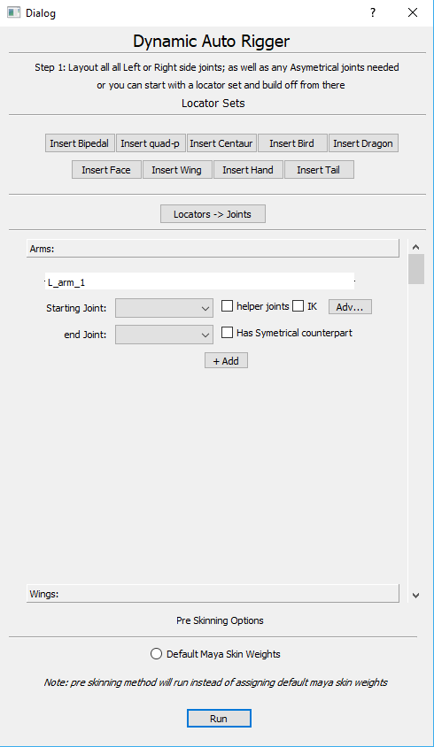

# Pythonic Auto Rigger Tool written for Autodesk Maya 2018

    This webscraper script uses beautiful soup and regular expressions to extract hours of operation from webpages

## Prerequisites:

* PyQt5
* Autodesk Maya 2018

## Built with:

* PyQt5
* Maya.cmds

## How to use:

1. Layout locators, as place holders, for all sysymetrical and one side of the symetrical joints; can also start with drop in locators sets.
2. create a joint hierarchy
3. assign rigging components for joint chains in rig
4. run build
    
## current progress:

    Still creating the bottom up design for the api package to be used in creating the tool.

## Main UI window wireframe:

    Quick wireframe design of the main dialog window for the tool, made in QtDesigner:

